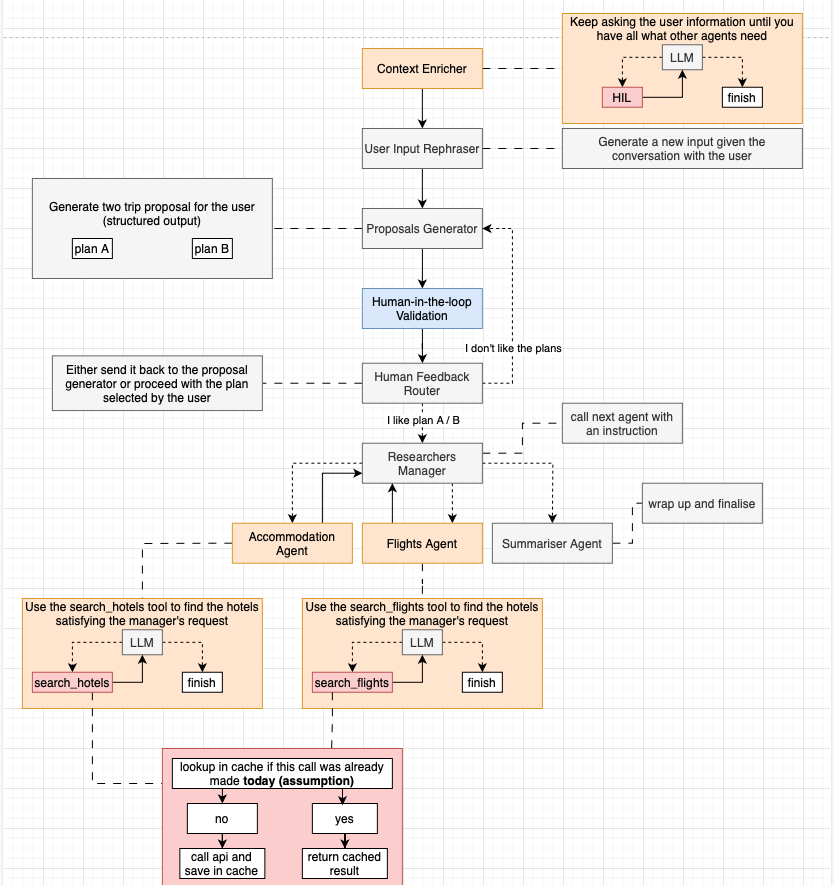

# Executive Summary

Watch my 20 minutes deep dive [here](https://manuelrech.com/projects/multiagent-travel-planner/)!

This application is a multi-agent system designed to generate comprehensive travel plans by orchestrating several specialized agents. Each agent is responsible for a specific task in the overall workflow, and they interact via a directed graph that guides inputs, enriches them, collects human feedback, and ultimately provides curated travel proposals.

---

## Workflow Overview

### 1. User Input and Initial Setup
- **User Input:**  
  The workflow begins when the user provides their travel preferences (e.g., “I would like to visit Barcelona”). This raw input is captured and passed to the system via the `Manager` class.
  
- **Graph Initialization:**  
  The `Manager` (located in `src/manager.py`) sets up the primary state graph which defines the sequence and connections between various agent nodes. For certain scenarios, an alternative graph (`graph_only_researchers`) is available.

---

### 2. Context Enrichment
- **Context Enricher Agent:**  
  - **Location:** `src/nodes/agents/context_enricher.py`  
  - **Role:** Clarifies and gathers essential travel details by prompting the user for additional information when necessary (using the `human_in_the_loop` tool).
  
- **Outcome:**  
  Ensures that all subsequent agents have a rich context from which to operate.

---

### 3. User Input Summarization
- **User Input Summary Agent:**  
  - **Location:** `src/nodes/llm/user_input_summary.py`  
  - **Role:** Reformulates the enriched details into a concise, first-person narrative.
  
- **Outcome:**  
  Produces an “enriched user input” that consolidates all essential travel details for the planning stage.

---

### 4. Trip Planning
- **Planner Agent:**  
  - **Location:** `src/nodes/llm/planner.py`  
  - **Role:** Generates two initial travel plan proposals (Plan A and Plan B) based on the enriched input.
  
- **Process:**  
  The agent can adjust proposals based on any previous human feedback.

---

### 5. Human Feedback Loop
- **Human Loop Node:**  
  - **Location:** `src/nodes/hil/human_loop.py`  
  - **Role:** Brings a human-in-the-loop phase into the process by presenting the user with the proposed plans.
  
- **Process:**  
  The user reviews the proposals and provides feedback (e.g., choosing a preferred plan or suggesting modifications).

---

### 6. Routing Based on Feedback
- **Router Agent:**  
  - **Location:** `src/nodes/llm/router.py`  
  - **Role:** Evaluates both the human feedback and the enriched input to determine the subsequent workflow path.
  
- **Outcome:**  
  Routes the process back to the planner for revisions or progresses it to specialized research.

---

### 7. Specialized Research
- **Researchers Manager Agent:**  
  - **Location:** `src/nodes/llm/research_manager.py`  
  - **Role:** Dispatches the workflow to specialized research agents based on the current state.
  
- **Specialized Agents:**  
  - **Flight Researcher Agent:**  
    - **Location:** `src/nodes/agents/flight_researcher.py`  
    - **Task:** Searches for flight options via the Amadeus API.
    
  - **Hotel Researcher Agent:**  
    - **Location:** `src/nodes/agents/hotel_researcher.py`  
    - **Task:** Retrieves hotel accommodation offers via the Amadeus API.

- **Persistent Caching for Research:**  
  Both the flight and hotel search tools use a Redis-based persistent caching mechanism (implemented in `src/cache/redis_cache.py`).  
  - **How It Works:**  
    When an API call for flight or hotel search is executed, its result is stored in Redis with a TTL of one day. Subsequent identical requests (same search parameters and within the same day) return the cached result, thereby reducing redundant API calls and speeding up the response.
  
---

### 8. Finalization and Summary
- **Trip Finalizer Agent:**  
  - **Location:** `src/nodes/llm/finalizer.py`  
  - **Role:** Consolidates all gathered information—including flight proposals, hotel proposals, enriched input, and the preferred plan—into a comprehensive travel summary.
  
- **Outcome:**  
  The user receives a final, detailed travel itinerary that clearly presents all available options.

---

### 9. State Management and Execution Flow
- **State Propagation:**  
  A mutable `State` object (defined in `src/states/state.py`) is passed along the workflow. Each agent enriches or modifies this state.
  
- **Graph-Based Workflow:**  
  The interconnected nodes in the workflow (outlined in `src/graphs/graph.py`) allow for dynamic routing based on human feedback and intermediate results.
  
- **Debug and Iteration:**  
  The `Manager` class supports a debug mode, which enables iteration and continuous refinement of the plan based on user input.

---

## Performance Optimization Through Persistent Caching

To improve efficiency and reduce the number of expensive API calls, the application incorporates a Redis-based caching mechanism:

- **Caching Implementation:**  
  The persistent cache is implemented in the file `src/cache/redis_cache.py` using Redis.  
  - **Usage in Agents:**  
    Both `search_flights` (located in `src/nodes/agents/tools/amadeus/search_flights.py`) and `search_hotels` (located in `src/nodes/agents/tools/amadeus/search_hotels.py`) instantiate a local RedisCache instance during each tool invocation.  
  - **Key Strategy:**  
    Each cache entry is keyed using the API call parameters (e.g., origin, destination, dates, and number of travelers) concatenated with the current date.  
  - **Benefits:**  
    - **Reduced Latency:** Repeated identical API requests within the same day are served from cache.
    - **Cost Efficiency:** Avoids redundant API calls by reusing previously fetched data.
    - **Scalability:** Supports multiple agents or processes accessing the cache concurrently in distributed deployments.
